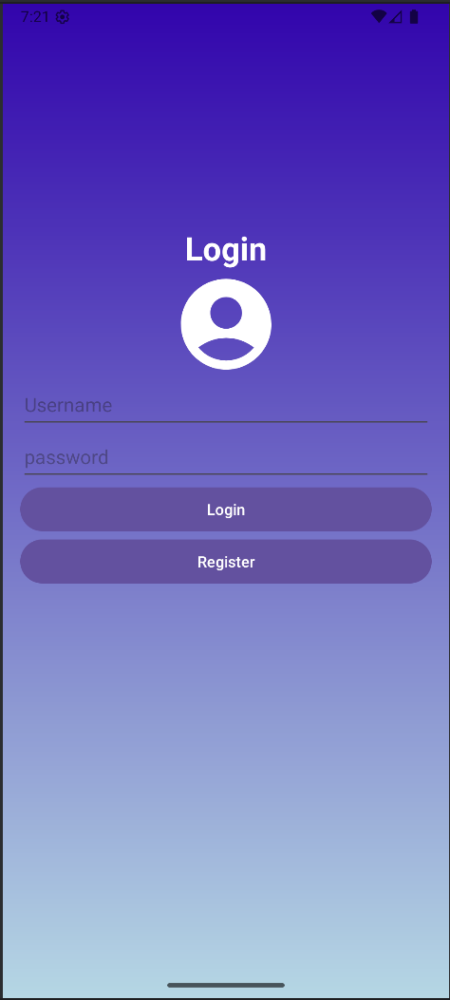
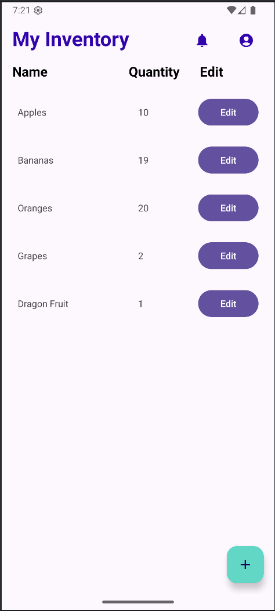
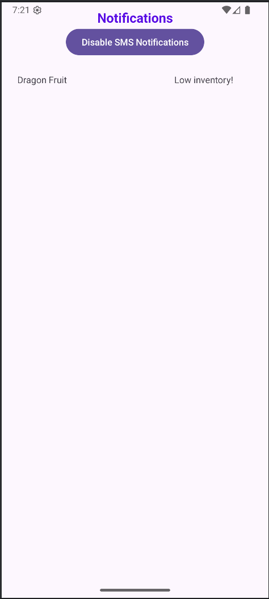
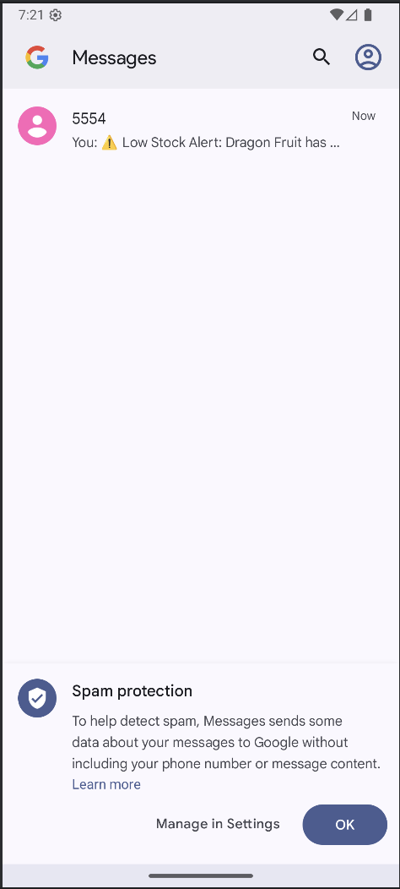

# CS360
*This is my final project and reflection for the course.*

## Project Checklist ✅
- [x] Allows user to login
- [x] Checks username against database
- [x] Create a database shell to store inventory items
- [x] User can preform CRUD operations on database
- [x] Display database on user home screen
- [x] Allow or deny SMS permissions
- [x] Display low inventory items in notification center and or send text alert if allowed

## Preview 👀

## Reflection 📝
### **Briefly summarize the requirements and goals of the app you developed. What user needs was this app designed to address?**

The requirements for the project were to create an inventory management application that allows the user to login. Once user credentials are verified, the user should see a list of all current inventory items with a real-time, accurate count. In addition to viewing the inventory, the user can also perform CRUD operations to create, read, update, and delete items from the inventory database. Finally, the application should ask for SMS permissions, and if granted, the user will receive low inventory alerts as well as notifications displayed in the notification center.

### **What screens and features were necessary to support user needs and produce a user-centered UI for the app? How did your UI designs keep users in mind? Why were your designs successful?**

The screens needed to support the user needs are the login screen, the home screen, and the notification screen. My UI design keeps users in mind by labeling each screen with a title so the user knows what screen they are currently on at all times. I also gave the inventory list column labels to easily identify what is being displayed. I believe my design choices were successful because they did not overcomplicate the project, and the application is simple with easily identifiable icons that even non-technical users can figure out.

### **How did you approach the process of coding your app? What techniques or strategies did you use? How could those techniques or strategies be applied in the future?**

I approached designing the app by breaking the task down into smaller steps, mainly separating the layout development from the functionality development. The first thing I did was view apps that have a similar use case and plan out how I should design mine layout-wise. Once the layout was decided, I created each screen that was needed. Once this was done, I created the code that made each layout functional.

### **How did you test to ensure your code was functional? Why is this process important, and what did it reveal?

The project was broken down into smaller steps, and each step was tested individually. For example, I populated the database with dummy data to ensure the CRUD functions worked as intended before moving on to creating the notification functionality. This was important because when an issue does arise, I have a better idea of where the problems are most likely from, which makes debugging and full application testing more manageable.

### **Consider the full app design and development process from initial planning to finalization. Where did you have to innovate to overcome a challenge?**

A specific part of the project where I had to innovate to overcome a challenge was when deleting all items or items in random order, the application would crash. This was caused by indexing errors. How I fixed this was refactoring the way I updated the RecyclerView by using LiveData to replace the list, which kept it synchronized with the database instead of manually removing items from the copied list (which caused out-of-bounds errors).

### **In what specific component of your mobile app were you particularly successful in demonstrating your knowledge, skills, and experience?**

An area I excelled in was the planning phase. Even though I had never created a full-stack project before, I believe I planned out the design phase in a realistic way based on the documentation I read. When I was actually coding the assignment, very few adjustments had to be made, and I followed my plan closely.
